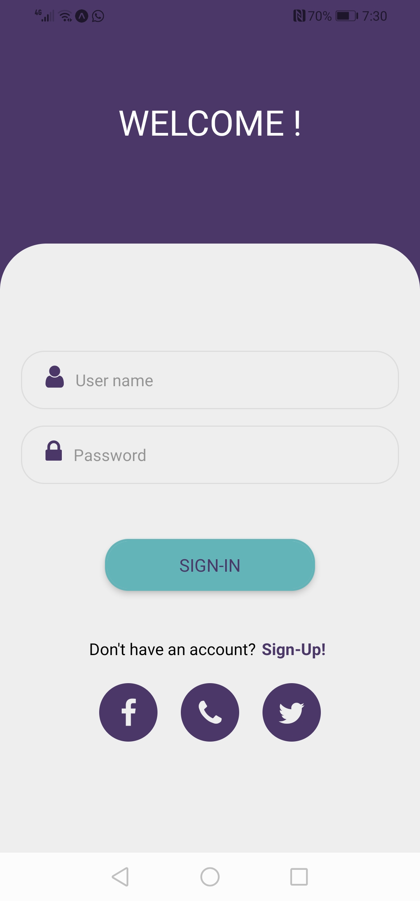
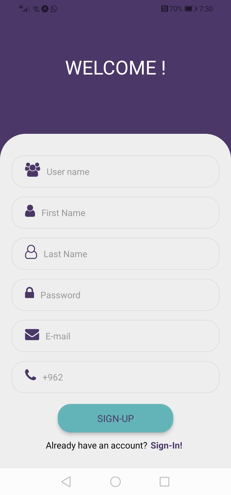
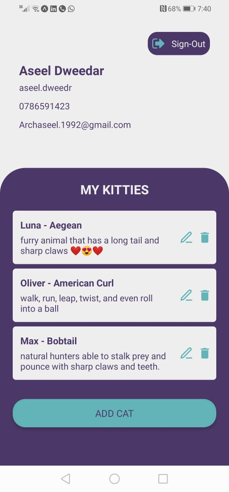
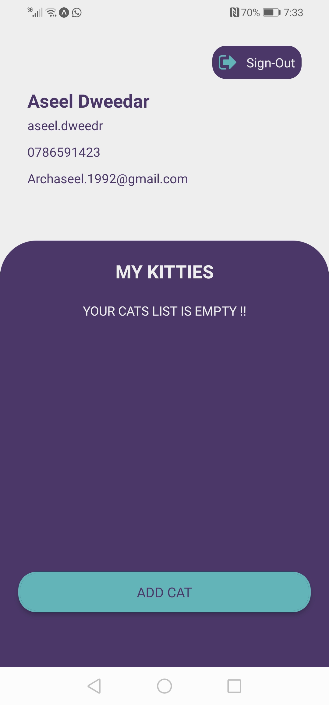
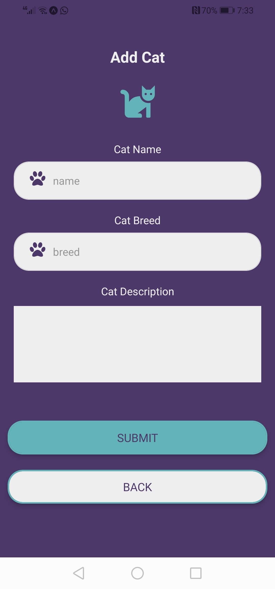
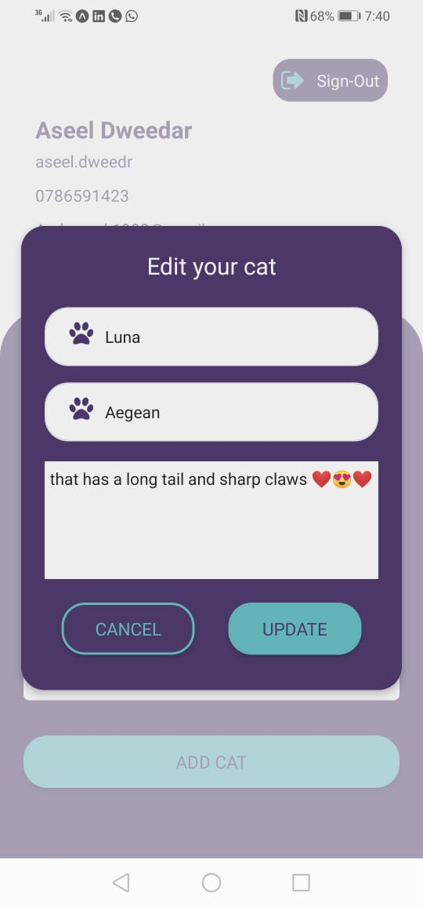

# My-kitties

If you owns so many cats that he can't keep track of
all of them. you needs some way to keep track of all
of your cats..

My-kitties is A mobile application that helps you to keep track of all of your cats. developed using React-native, Node.js (Express), MongoDB.

It is designed to be easy to use and with high accuracy. Taking into account the consistency of colors, and various designs. To make the user experience unique.

### **How to start** ..

- **Server side**

  Clone the repository --> npm install --> add to env file all necessary link as added in the `.env.sample` file.

- **Clint side**

  move to clint-frontend --> yarn/npm install --> add to env file all necessary link as added in the `.env.sample` file.

## App content

**Sign-In - Sign-Up**

 

**profile page**

 

**Add new cat**

 

**Edit Your Cat**

